# Part Workbench Notes

June 1, 2022

# Authors

Allie Gonzales

# Goal:

FreeCAD users will learn to use the part workbench through a guided exercise. Students will use boolean operations such as cut, union, and intersection to model a weighted positioning arm base.

# Guide & Exercise

**Importing the drawing**

Load the draft workbench and import the arm-base.dxf drawing. Set the standard view to 'Top', and delete the title block using a box selection (Shift + B). The drawing should now look like the example below.

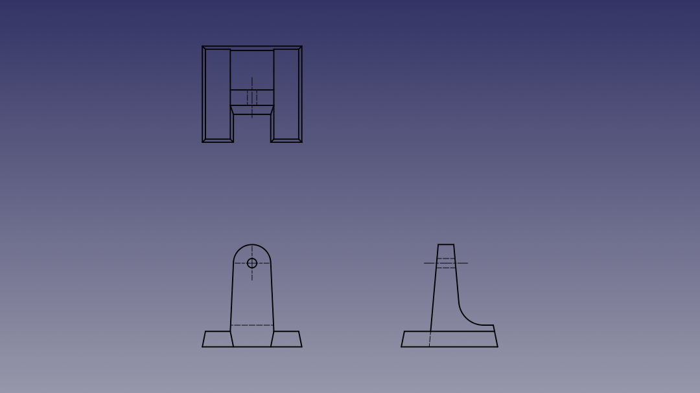

Delete any internal lines in each projection. We will leave the hole and two angled lines on the front projection, and delete the bottom line. We will redraw this in three sections in the next step. The drawing should now look like the example below.

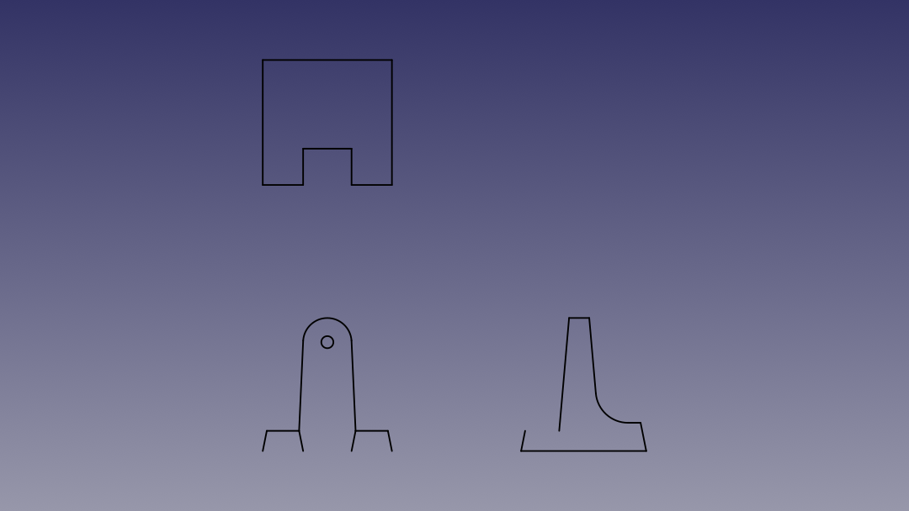

Toggle the endpoint snap before continuing to the next step.

Redraw the bottom line on the front projection in three sections. Start the Line command (L, I), and use Continue (T) to stay in this command. Close the side projection with a line. Each line drawn is numbered below.

**Upgrading shapes to faces**

Select one, or both, top and side projections, and upgrade both to a wire, then a face object. You can verify the type of object in the scene using the outliner. You should now have two faces and any remaining shapes in the outliner. The remaining shapes are lines on the front projection. We will use the part workbench to create these faces.

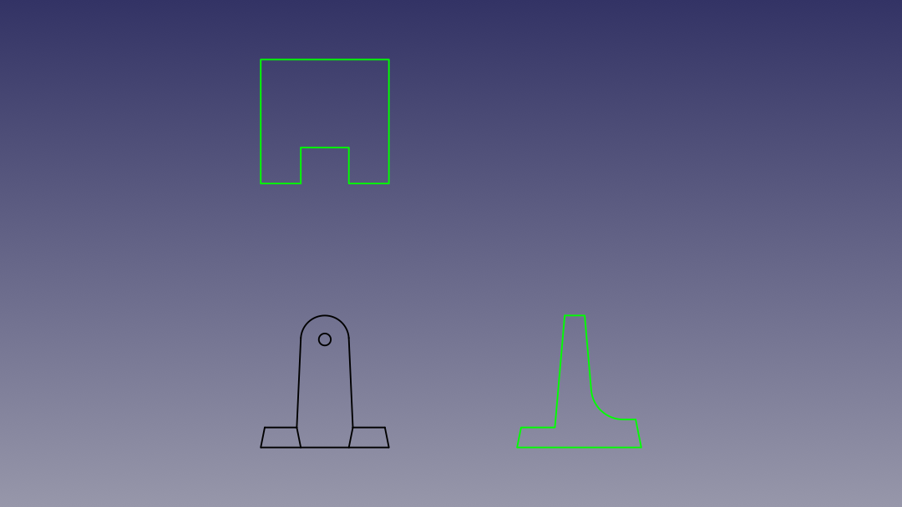

The drawing should now look like the example below.

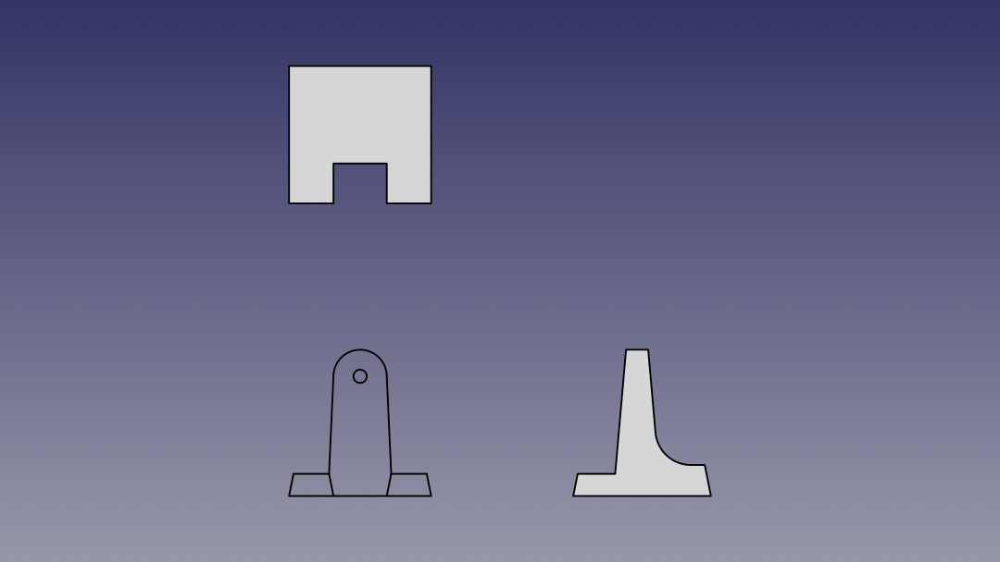

**The part workbench**

Load the part workbench and start the Shape builder command.

Select 'Face from edges'.

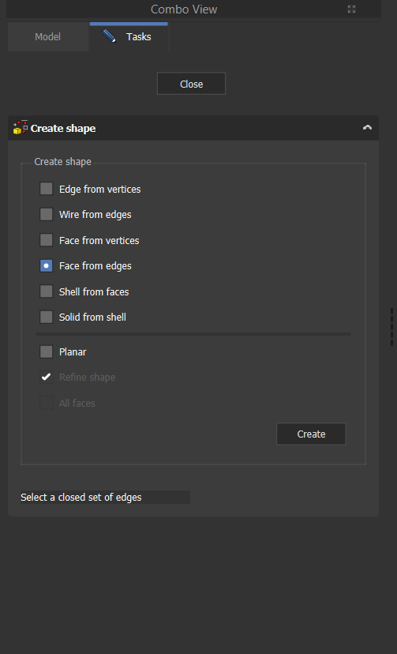

Select each bounding edge on a face that will be created. Click 'Create' to create a face. FreeCAD will stay in this command and you can re-use edges to create other faces.

You will create four faces on the front projection.

- A circular face for the hole
- Two faces for the legs
- A face for the main body

Each face created is numbered below.

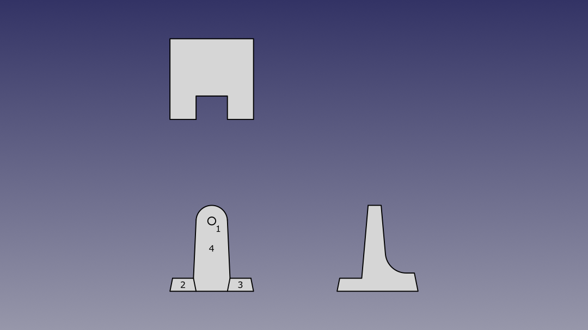

We no longer need the remaining shapes in the outliner. You can either select and hide these objects, or delete them from the scene. I've chosen to hide them in the example below.

**Extruding the faces**

Set the view to 'Isometric' and extrude each face to their measured length. Refer to arm-base.pdf for detailed measurements.

An example of each extruded face is provided below. For each extrusion, set the direction to ‘Custom direction’ and ensure that the value set for ‘Z’ is positive. The face for the hole can be extruded to an arbitrary value equal to or larger than 1+3/8”, I have chosen to extrude this face to two inches.

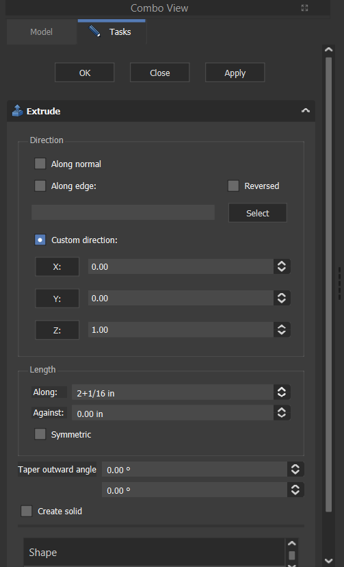
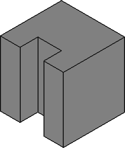

Extrude top projection

Extrude side projection

Extrude hole

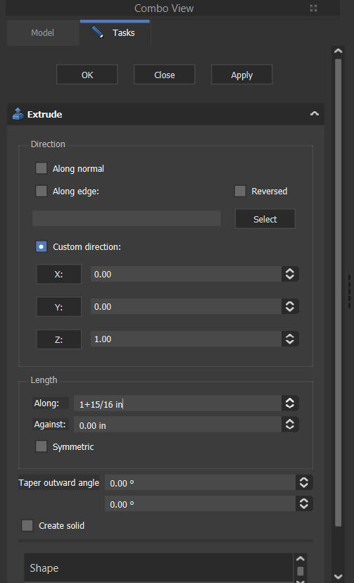

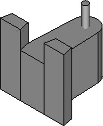

Extrude front projection

The drawing should now look like the example below.

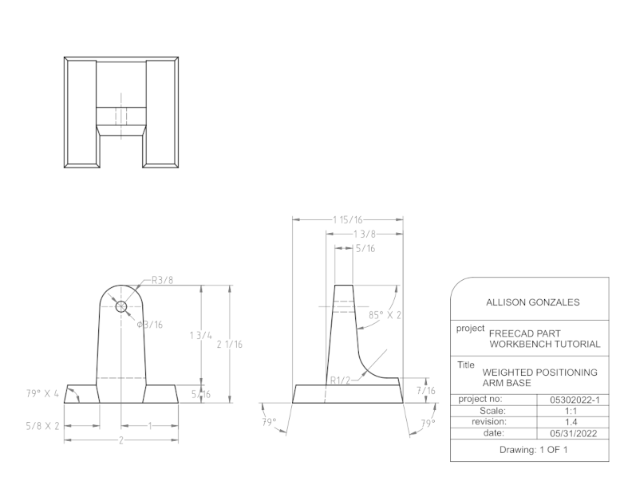
arm-base.pdf

**Boolean operations: Cut**

On the front projection select the main body extrusion, then select the hole extrusion. Preform a 'Cut' operation using the Boolean toolbar.

The front projection should look like the example below.

**Boolean operations: Union**

Select the main body extrusion and the two leg extrusions. Preform a 'Union' operation from the Boolean toolbar. Nothing will change visually in the scene. However, the changes are reflected in the outliner. There should be two extrusions and one fusion object.

The outliner should look like the example below.

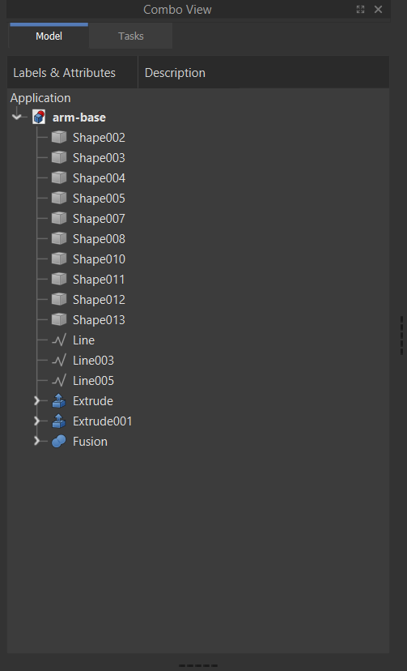

**Aligning the objects**

To preform an 'Intersection' operation the objects must be aligned according to the view projected to create the desired shape. We will use FreeCAD's alignment tool to place each object inside each other. Select an edge on an object you would like to stay fixed. I've preselected one on the front projection. Select another edge that will be collinear with the first object. Start the Alignment command (Menubar: Edit → Alignment).

Select three points on the movable object and three points on the fixed object. Make sure to select the points in the same order and points that will coincide on the aligned objects. I've chosen to select three points on the bottom. An example is provided below. Right click and select 'Align' to finish the command.

The drawing should now look like the example below.

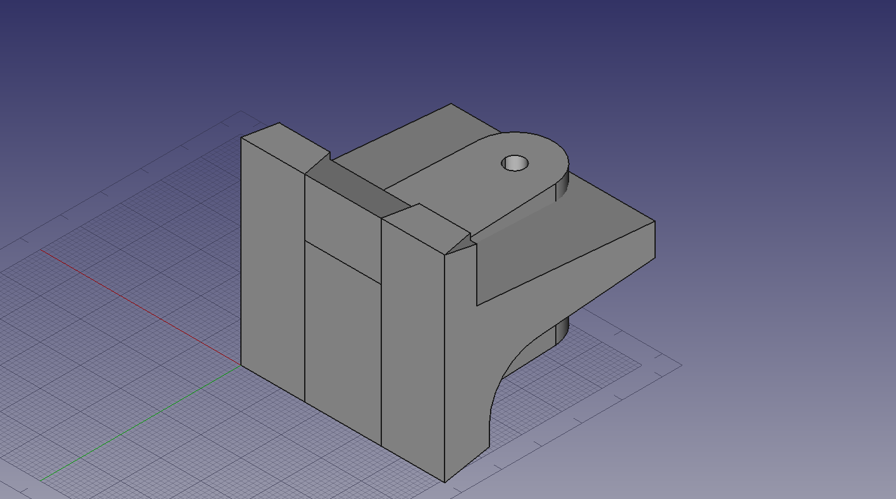

Preform the same steps to make the second alignment. The drawing should now look like the example below.

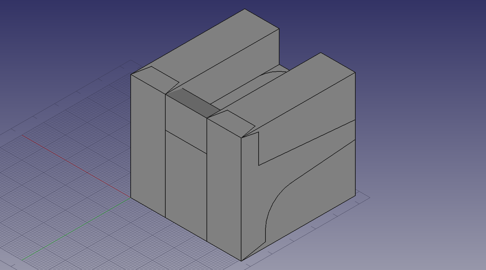

**Boolean operations: Intersection**

Select all three objects and preform an 'Intersection' operation.

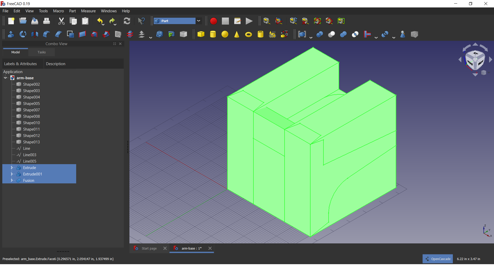

The drawing should now look like the example below.

Double click the object in the outliner and rotate the object upright. The weighted arm base is now finished and an example is provided below.

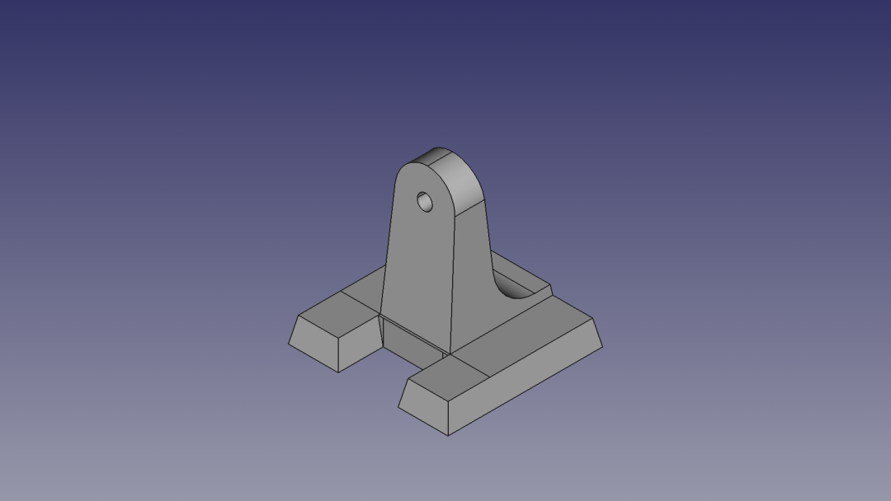